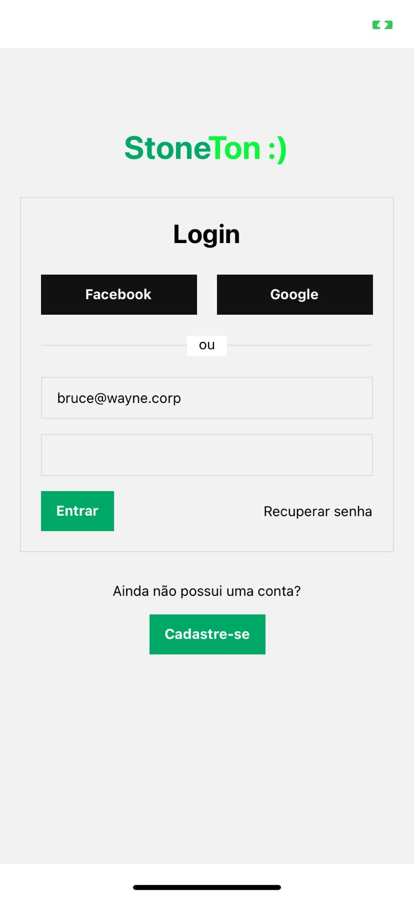
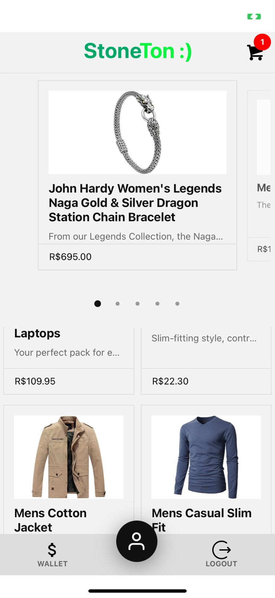
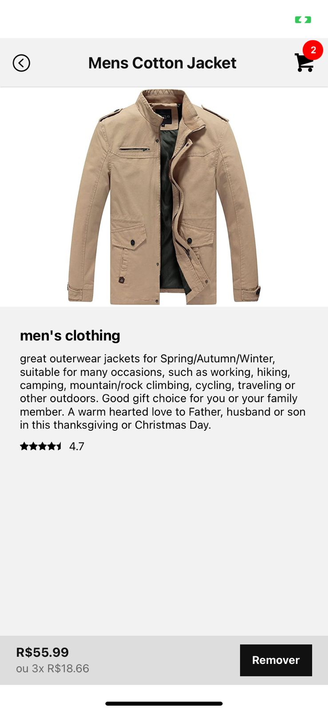
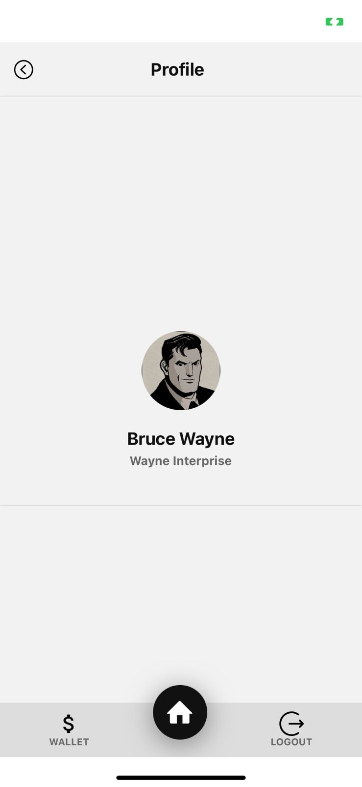

<h1 align="center">
  Stone Test
</h1>

<div align="center">

|                                                        Technology                                                             |  Name             | Site              |
| :---------------------------------------------------------------------------------------------------------------------------: | :---------------: | :---------------: |
|  |      Jest         | https://jestjs.io/pt-BR/
|  |      Yarn         | https://classic.yarnpkg.com/lang/en/docs/install/#debian-stable
|  |      React Native | https://reactnative.dev/
|  |      TS           | https://www.typescriptlang.org/
|   |      Storybook    | https://storybook.js.org/
|                               |      Expo         | https://expo.dev/

</div>

## 🚅 Quick start

1.  **Run app.**

    ```shell
    # Install the dependencies
    yarn

    # Run
    yarn start
    ```

2.  **Run Storybook.**

    ```shell
    # Install the dependencies
    yarn

    # run
    yarn storybook
    ```

3.  **Run Tests.**

    ```shell
    # Install the dependencies
    yarn

    # run
    yarn test
    ```

## 🔎 What's inside?

A quick look at the top-level files and directories included with this template.

```shell
.
├── app
├── components
├── patches
├── stores
├── theme
├── contexts
├── assets
├── Error.handler.tsx
```

1.  **`app`**: This folder is intended for the project pages and navigation

2.  **`components`**: stateless components of every application.

3.  **`stores`**: folder dedicated to mobx states.

4.  **`theme`**: theme variables.

5.  **`contexts`**: React context API.

6.  **`assets`**: images, fonts, icons.

7.  **`Error.handler.tsx`**: Global error handler for exceptions management.

## 📷 Images

<p float="left" align="center">
  
  
  
  
  
  
</p>
